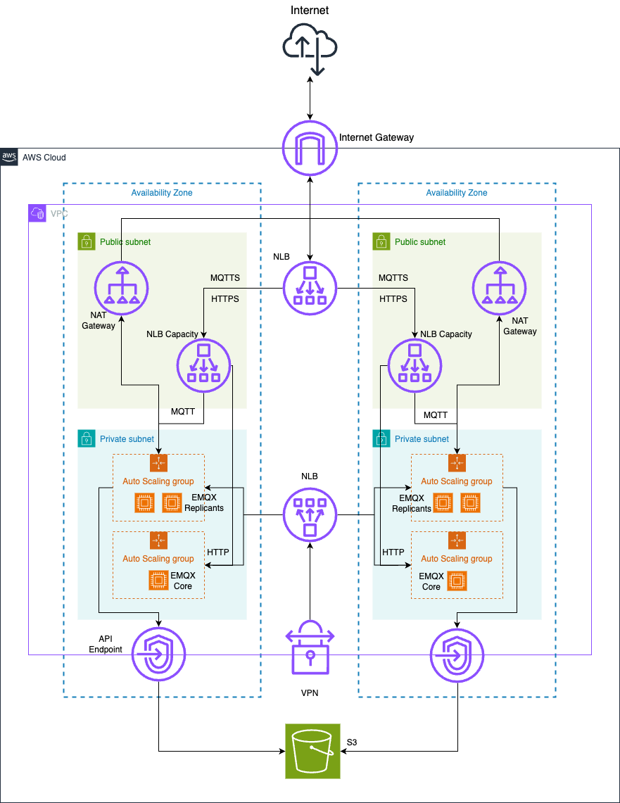

# EMQX Enterprise For Internet of Vehicles

Collection of scripts to setup EMQX Enterprise 5.8.2 for IoV (Internet of Vehicles) demo environment in AWS.

Demoed features:

- [TODO] HTTP authentication with ACL.
- [TODO] Collect messages in files and upload to s3.

## Start

Prerequisite: install [Terraform](https://developer.hashicorp.com/terraform/install).

```bash
terraform init
terraform apply
```

After the setup is complete, you will see the DNS name of the load balancer. Visit the EMQX dashboard at the URL `https://iov-s3-demo.emqx.works/`. Login username is `admin` and password is also `admin`.


